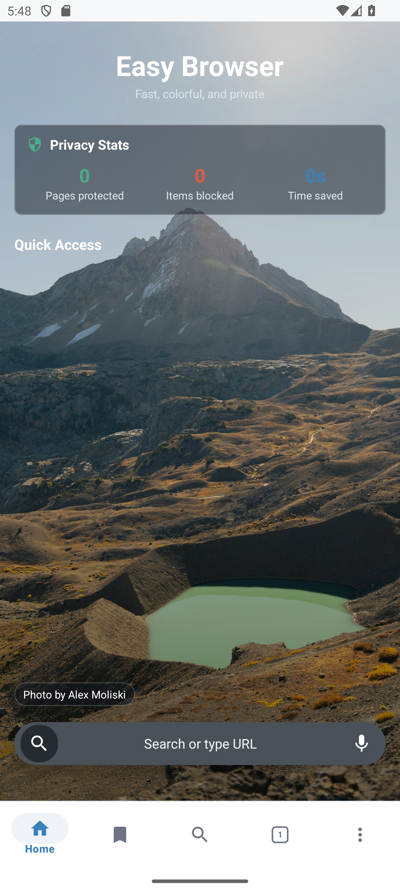
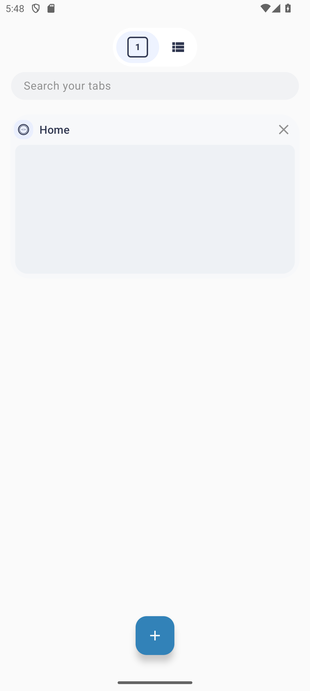
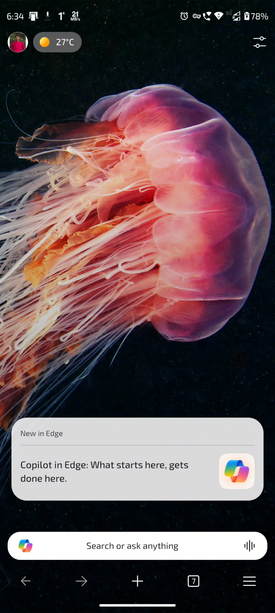

# Easy Browser

Easy Browser is a privacy-focused Android browser built on Mozilla GeckoView, not the system WebView. It includes native tab management, tab groups, persistent browser state, ad and tracker blocking, HTTPS-only mode, private browsing, downloads with pause/resume, bookmarks, history, reading list, site permissions, per-site user styles, and a built-in weather dashboard.

## Screenshots

| Home | Search | Page | Tabs |
|:---:|:---:|:---:|:---:|
|  |  |  |  |
| Home review | Room home | Room tabs | Video review |
|  |  |  |  |

## Why GeckoView

Most alternative Android browsers wrap the system WebView, which means they inherit whatever the device vendor ships. Easy Browser embeds Gecko, the same engine that powers Firefox, giving consistent rendering and modern browser security features across Android 5.0+ devices.

## Features

- **Tabs and groups** - persistent normal tabs, private tabs that stay off disk, tab search, grouped tabs, inactive tabs, tab thumbnails, group previews, and quick tab switching
- **Privacy** - three blocking levels, GeckoView Enhanced Tracking Protection, built-in cosmetic ad-blocking extension, cookie-banner rejection, tracking-parameter stripping, Do Not Track, HTTPS-only mode, popup blocking, and optional screenshot protection
- **Downloads** - OkHttp-backed downloads with Range resume, MediaStore publishing on API 29+, Wi-Fi-only queuing, speed tracking, and pause/resume handling
- **Search** - DuckDuckGo by default, with configurable engines such as Brave Search, Google, Bing, Ecosia, Yahoo, and custom providers
- **Home screen** - privacy stats, pinned quick-access shortcuts, a horizontally scrolling shortcut carousel, photo-backed background, and bottom navigation for repeated browser workflows
- **Weather** - current conditions, realtime sky-condition artwork, hourly forecast, 7-day forecast, and AQI using the selected device or manual location
- **Per-site controls** - user CSS injection, custom zoom, permissions, cookies, and storage controls
- **Reading list** - save pages for later reading
- **Extensions** - GeckoView web extension support hooks, bundled extension assets, and extension-management UI

## Tech Stack

| | |
|---|---|
| Language | Java 11 |
| Min SDK | 21 (Android 5.0) |
| Target SDK | 37 |
| Engine | Mozilla GeckoView 143 |
| Database | Room 2.6.1 (`browser.db`, v10) |
| Network | OkHttp 5.3.2 |
| Image loading | Glide 5.0.7 |
| DI | None - singletons plus Android `ViewModel` / `AndroidViewModel` classes |

## Weather Data

Weather forecasts come from MET Norway Locationforecast. Air quality uses Open-Meteo Air Quality with the same latitude and longitude as the active weather location; the displayed AQI value is on the US AQI scale, not a US-based location lookup.

## Build

Use the Gradle wrapper from the repository root.

```powershell
# Debug APK
.\gradlew.bat assembleDebug

# Unit tests
.\gradlew.bat testDebugUnitTest

# Instrumented tests (requires a connected device or emulator)
.\gradlew.bat connectedDebugAndroidTest

# Lint
.\gradlew.bat lintDebug

# Clean generated build output
.\gradlew.bat clean
```

Release builds read signing values from `keystore.properties` at the project root. Copy `keystore.properties.example`, fill in real values locally, and keep the real file out of Git.

GeckoView is fetched from Mozilla's Maven repository, so the first build needs internet access.

## Architecture

```text
MainActivity
  -> BrowserActivity
        -> BrowserViewModel
              -> TabManager
                    -> Tab / TabGroup
                          -> GeckoSession
                                -> singleton GeckoRuntime

Room database
  -> DAO
        -> Repository
              -> Activity / ViewModel
```

- Browser delegates for navigation, content, progress, permissions, prompts, and history are configured from `BrowserActivity`.
- Normal tab and group metadata is persisted through Room entities and repository classes; private tab state is kept out of durable storage.
- `BrowserStateStore` keeps lightweight browser state in preferences, while `TabRepository` handles persisted tabs and groups.
- Repository background work uses the shared executor from `AppDatabase.getDatabaseExecutor()`.
- Blocking runs through GeckoView content blocking plus URL and host checks in `UrlUtils`.

See [CLAUDE.md](CLAUDE.md) for deeper architecture and preference notes.

## Security Posture

Recent hardening covers:

- `allowBackup="false"` and restrictive data-extraction rules
- FileProvider paths scoped to app-controlled download cache paths
- Intent extras and incoming URLs validated before navigation
- JavaScript and CSS injection paths escaped or encoded before use
- Path-traversal and bidi-control sanitization for downloaded filenames
- Range-download safeguards when a server returns HTTP 200 to a resumed request
- Immutable `PendingIntent` usage
- Optional `FLAG_SECURE` screenshot protection across activities
- HTTPS-only enforcement for top-level navigation

## License

[MIT](LICENSE) (c) 2026 Riju Pakira
